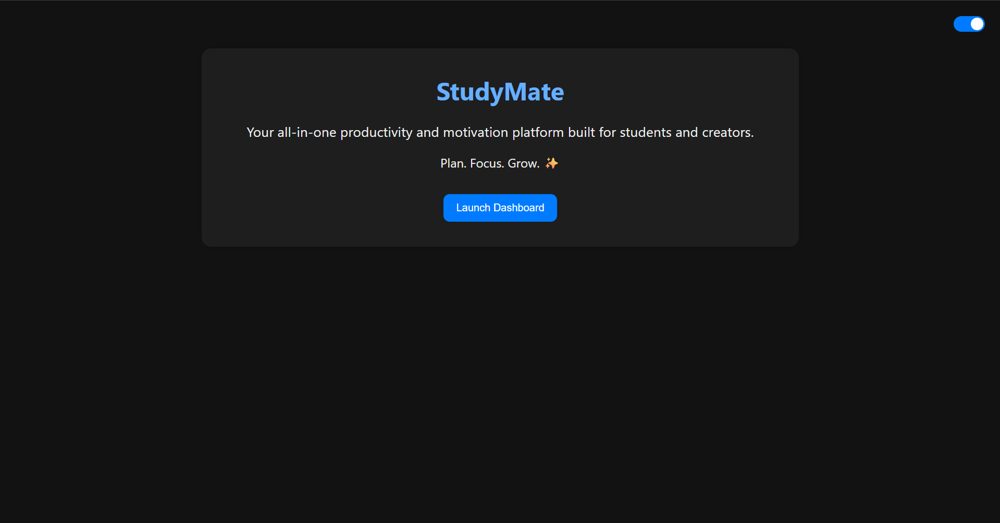

# 📚 StudyMate — Your All-in-One Study Companion

**StudyMate** is a full-stack productivity web app that helps students stay focused, organized, and inspired.  
Built with **Flask**, **OpenAI GPT-3.5**, and ❤️ for learning — it's your personal dashboard for study success.

---

## 🚀 Features

✅ **Dashboard** with easy navigation  
✅ **Goals Tracker** with add/delete support  
✅ **Pomodoro Timer** with countdown animation  
✅ **Motivational Quotes** loaded from `.txt`  
✅ **AI Assistant** powered by OpenAI GPT-3.5  
✅ **Dark Mode Toggle** (remembers your choice!)  
✅ **Minimal, responsive UI** with clean UX  
✅ **No DB Required** — just `.txt` files for simplicity

---

## 💻 Tech Stack

- Python 3  
- Flask  
- HTML, CSS, JS  
- OpenAI API (via `chat.completions`)  
- dotenv for API key security  
- Deployed locally (but ready for Render/Heroku/etc)

---

## 📸 Preview
  


---

## 🧠 Why I Built It

As a CS50 student, I wanted to build something useful, real, and personal.  
**StudyMate** is my first full-stack project — made to help myself and others stay motivated while learning.

---

## 🛠️ Setup Instructions

```bash
# Clone the repo
git clone https://github.com/dev-erebus/studymate.git
cd studymate

# (Optional) Create a virtual environment
python -m venv venv
venv\Scripts\activate  # Windows

# Install dependencies
pip install -r requirements.txt

# Add your OpenAI key
touch .env
# Inside .env:
OPENAI_API_KEY=sk-...

# Run it
python studymate.py
